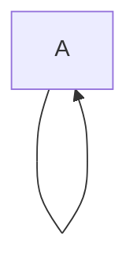
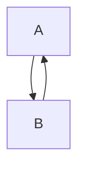
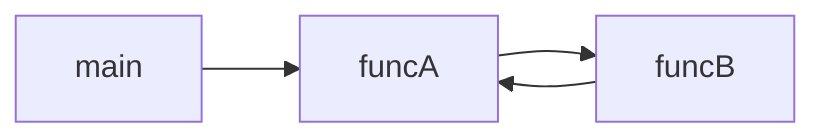
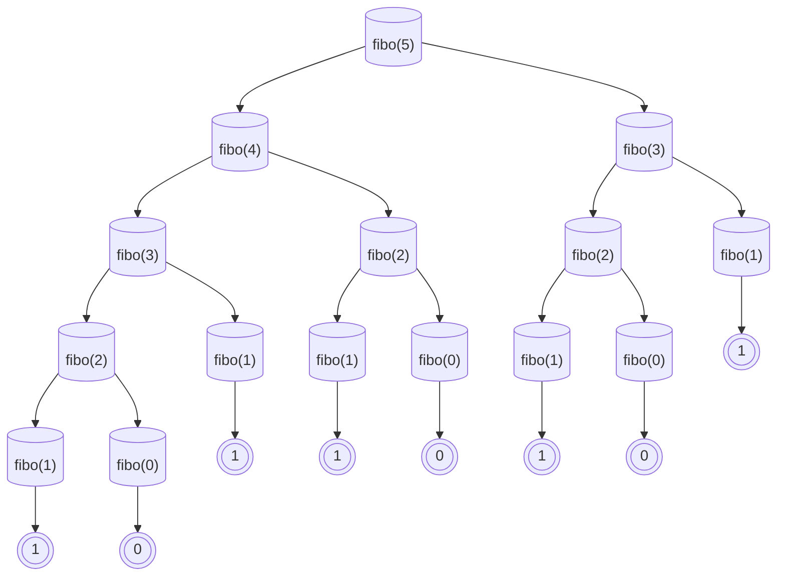

# Recursion


### What is Recursion?

- Recursion is a process in which a function calls itself. 
- The function calls itself until the base condition is reached. 


Before diving into the topic of recursion, let's try to understand the topics of iteration and it's importance. 
Let's consider a code snippet.


```java
public class TestExample{
  public static void main(String args[]){
    for(byte i=1; i<=10; i++){
        System.out.println(i);
    }
  }
}
```

It's very obvious that the loop's gonna print the numbers from $1$ to $10$. 
Now, Let's look at other example. 

```java
public class TestExample{
  public static void main(String args[]){
    for(byte i=1; i!=0; i++){
        System.out.println(i);
    }
  }
}
```
>Think about it: Is this a infinte loop?

Commonly, we tend to misunderstand it as an infinte loop. But in the actual case, it is not an infinite loop. The loop runs until the size of `byte` is exceeded. The size of `byte` is $255$. The range lies between $-256$ to $+255$. 

Let's consider an another example which showcases the infinte loop. 

```java
public class TestExample{
  public static void main(String args[]){
    for(byte i=1; true; i++){   // the condition is always true, making it an infinte loop
        System.out.println(i);
    }
  }
}
```

Now, coming back to the topic, Let's see a standard example of recursion. 

Here's an example of finding the factorial of a number using recursion. 

```java
import java.util.Scanner;
public class FactorialExample{
  public static void main(String args[]){
    Scanner sc = new Scanner(System.in);
    System.out.print("Enter the number (to find its factorial): ");
    int number = sc.nextInt();
    System.out.println(factorial(number)); // prints the factorial of the given number
  }
  public static int factorial(int number){
    if(number < 2){   // base condition that terminates the recursion
      return;
    }
    return number * factorial(number-1);    // recursive part of the function
  }
}
```

### Components of Recursion

Basically, every recursive function is made up of two parts:
- **Base case**: used to terminate the recursion.
- **Recursive case**: used to execute the code recursively (repeatedly).

Here's some more things you need to know about recursion: 
- Recursion uses stack memory. 
- Each time a recursive function is called, the recursive address is stored in the stack memory. 
- The stack memory is a finite memory. If the memory gets full, it leads to `StackOverFlow` error. 
- A function without a base condition leads to Infinite recursion which in turn depletes the stack memory. 

> More to know: The default package (implicitly imported) in JAVA is `lang`.


### Types of Recursion

There are two major types of recursion and they are:
1. Direct recursion: A function calls itself

2. Indirect recursion: A function calls another function which calls the preceeding function recursively. 



The direct recursion is further classified as, 
- Tail recursion
- Head recursion
- Tree recursion
- Nested recursion

We have seen a couple of examples before which showcases the direct recursion. Now let's look at some examples which showcases the indirect recursion.

```java
public class IndirectRecursion{
  public static void funcA(int n){
    if(n <1){
      return;
    }
    System.out.println(n);
    funcB(n-1); 
  }
  public static void funcB(int n){
    if(n <1){
      return;
    }
    System.out.println(n);
    funcA(n/2);
  }
  public static void main(String args[]){
    funcA(50);
  }
}
```

**Output:**
```bash
50
49
24
23
11
10
5
4
2
1

```

Here's the flow of execution happens recursively involving two different functions. 




#### Fibonacci Series - Example (Iterative Approach)

The fibonacci series in one of the most famous example of recursion. Firstly, we'll try to implement it without recursion (iterative approach).

```java
import java.util.Scanner;
public class FiboSeries{  // Iterative Approach
  public static void main(String args[]){
    Scanner sc = new Scanner(System.in);
    System.out.print("Enter the number of terms: ");
    int n = sc.nextInt();

    int first = 0; int second = 1;
    System.out.print(first + " " + second);

    for(int i=2; i<n; i++){
      int current = first + second; 
      System.out.print(" "+current);

      first = second;
      second = current;
    }
  }
}

```

**Sample Output:**

```bash
Enter the number of terms: 10
0 1 1 2 3 5 8 13 21 34
```

#### Fibonacci Series - Example (Recursive Approach)

The recursive implementation of the Fibonacci Series is as follows:

```java
import java.util.Scanner;
public class FiboSeries{  // Recursive Approach
  public static void main(String args[]){
    Scanner sc = new Scanner(System.in);
    System.out.print("Enter the number of terms: ");
    int n = sc.nextInt();

    printFiboSeries(n);
  }

  public static void printFiboSeries(int n){
    for(int i=0; i<n; i++){
      System.out.print(fibo(i) + " ");
    }
  }

  public static void fibo(int n){
    if(n < 2){
      return n;
    }

    return fibo(n-1) + fibo(n-2);
  }
}

```
**Sample Output:**

```bash
Enter the number of terms: 10
0 1 1 2 3 5 8 13 21 34 

```

This is an exmaple of Tree Recursion. 



The base condition imples that `fibo(0)` and `fibo(1)` is the number itself i.e. $0$ and $1$ respectively. The parent node gets its value by adding the values of its children node. This process continues till the root node and the end value of `fibo(5)` is 5 i.e. starting the range as $0, 1, 2, 3, ... $

> We can also compute the final resultant value by the summation of the values of the root nodes. In this case, 
$$ fibo(5) = 1+0+1+1+0+1+0+1 = 5 $$

----

#### Power of N - Iterative approach 


```java
import java.util.Scanner;
public class powerOfNExample{
  public static int power(int base, int exp){
    int res = 1;
    for(int i=0; i<exp; i++){
      res *= base;
    }
    return res;
  }
  public static void main(String args[]){
    Scanner sc = new Scanner(System.in);
    System.out.print("Enter the base value: ");
    int base = sc.nextInt();
    System.out.print("Enter the exponent value: ");
    int exp= sc.nextInt();
    int res = power(base, exp);
    System.out.print("The value of " +base+ " to the power of " +exp+" is " +res);
  }
}

```

**Sample Output:**

```bash
Enter the base value: 2
Enter the exponent value: 8
The value of 2 to the power of 8 is 256
```

#### Power of N - Recursive approach 


```java
import java.util.Scanner;
public class powerOfNExample{
  public static int power(int base, int exp){
    if(exp == 0){
      return 1;
    }
    return base * power(base, exp-1);
  }
  public static void main(String args[]){
    Scanner sc = new Scanner(System.in);
    System.out.print("Enter the base value: ");
    int base = sc.nextInt();
    System.out.print("Enter the exponent value: ");
    int exp= sc.nextInt();
    int res = power(base, exp);
    System.out.print("The value of " +base+ " to the power of " +exp+" is " +res);
  }
}

```

**Sample Output:**

```bash
Enter the base value: 4
Enter the exponent value: 2
The value of 4 to the power of 2 is 16
```

This approach works only for the positive numbers. When we try providing the exponent value as a negative number, it fails to result the correct answer. So, let's try to tweak the logic a bit to make the program suitable for negative numbers. 

```java
import java.util.Scanner;
public class powerOfNExample{      // compatible for negative numbers
  public static double power(double base, double exp){
    double res = 1.0; boolean isNegative = false;
    if(exp < 0){            // exponent part being a negative number
        exp = -exp;
        isNegative = true;
    }
    for(int i=0; i<exp; i++){
      res *= base;
    }
    return isNegative? 1/res : res;
  }
  public static void main(String args[]){
    Scanner sc = new Scanner(System.in);
    System.out.print("Enter the base value: ");
    double base = sc.nextDouble();
    System.out.print("Enter the exponent value: ");
    double exp= sc.nextDouble();
    double res = power(base, exp);
    System.out.print("The value of " +base+ " to the power of " +exp+" is " +res);
  }
}
```
**Sample Output Cases:**
```bash
Enter the base value: 2
Enter the exponent value: -3
The value of 2 to the power of -3 is 0.125
--------------------------------------------------------------
Enter the base value: 3.3
Enter the exponent value: 2.1
The value of 3.3 to the power of 2.1 is 35.937
--------------------------------------------------------------
Enter the base value: 10
Enter the exponent value: -10
The value of 10.0 to the power of -10.0 is 1.0E-10
```

Now, let's try to code this using the recursive approach. 

```java
import java.util.Scanner;
public class powerOfNExample{   // compatible for negative numbers
  public static double power(int base, int exp){
    boolean isNegative = false;
    if(exp < 0){     // handles negative numbers
        isNegative = true;
        exp = exp * -1;
    }
    if(exp == 0){
      return 1.0;
    }
    return isNegative? 1/(base * power(base, exp-1)) : base * power(base, exp-1);
  }
  public static void main(String args[]){
    Scanner sc = new Scanner(System.in);
    System.out.print("Enter the base value: ");
    int base = sc.nextInt();
    System.out.print("Enter the exponent value: ");
    int exp= sc.nextInt();
    double res = power(base, exp);
    System.out.print("The value of " +base+ " to the power of " +exp+" is " +res);
  }
}
```
**Sample Output:**
```bash
Enter the base value: 3
Enter the exponent value: -3
The value of 3 to the power of -3 is 0.037037037037037035
```
----

#### Sum of Natural Numbers - Iterative Approach / Mathematical Approach

Now let's try an another example of determining the sum of natural numbers up to N. 

```java
import java.util.Scanner;
public class SumOfNaturalNumbers{
  public static void main(String args[]){
    Scanner sc = new Scanner(System.in);
    System.out.println("Enter a value of N: ");
    int n = sc.nextInt();
    int sum = 0;
    for(int i=1; i<=n; i++){
      sum += i;
    }
    System.out.println("The sum of numbers upto " + n +" is " + sum);
  }
}

```
**Sample Output:**
```bash
Enter a value of N: 10
The sum of numbers upto 10 is 55
```

This can also be implemented using mathematical formulae. This approach is much faster than the iterative approach. 

```java
import java.util.Scanner;
public class SumOfNaturalNumbers{
  public static void main(String args[]){
    Scanner sc = new Scanner(System.in);
    System.out.println("Enter a value of N: ");
    int n = sc.nextInt();
    double sum = (n* (n+1)) / 2;
    System.out.println("The sum of numbers upto " + n +" is " + sum);
  }
}
```
**Sample Output:**
```bash
Enter a value of N: 15
The sum of numbers upto 15 is 120.0
```
#### Sum of Natural Numbers - Recursive Approach 
Now, Let's try to implement this using the recursive approach.

```java
import java.util.Scanner;
public class SumOfNaturalNumbers{
  public static int computeSum(int n){
    if(n == 0){
      return 0;
    }
    return n + computeSum(n-1);
  }
  public static void main(String args[]){
    Scanner sc = new Scanner(System.in);
    System.out.print("Enter a value of N: ");
    int n = sc.nextInt();
    int sum = computeSum(n);
    System.out.println("The sum of numbers upto " + n +" is " + sum);
  }
}
```